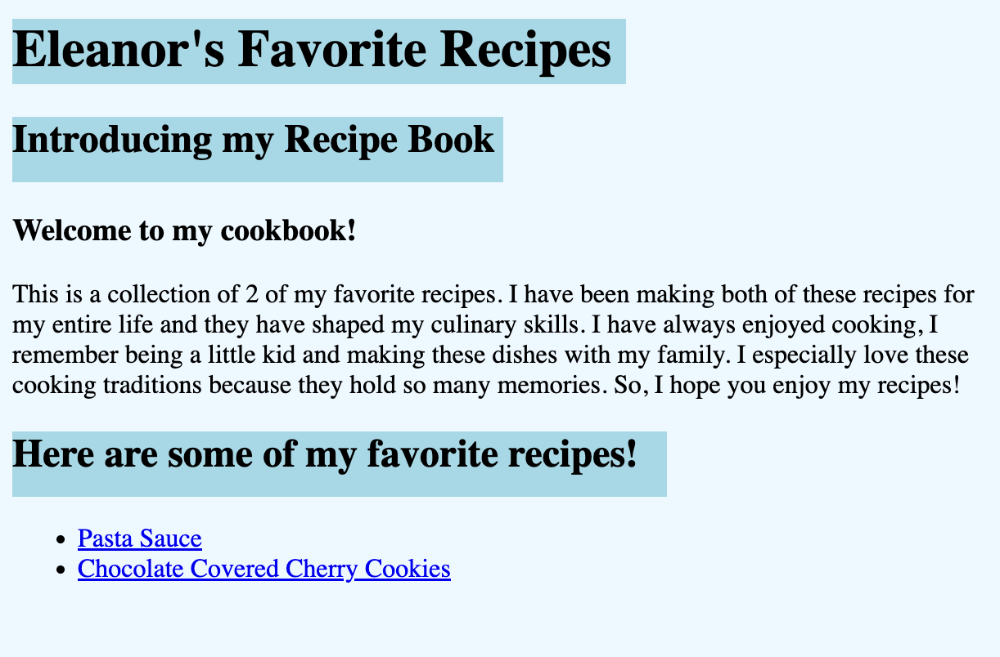
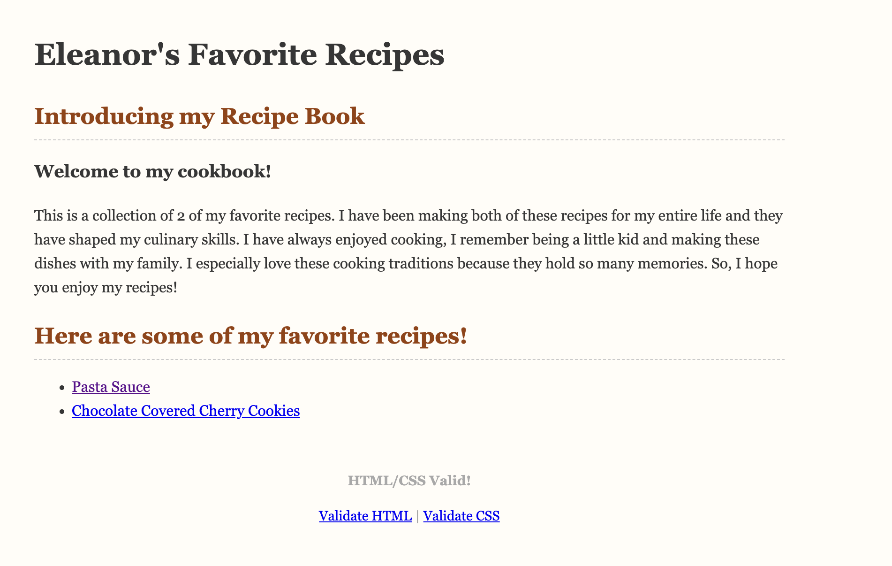

# Final Project Reflection: Styling My Recipe Book

For my final project, I chose to look at and improve my  recipe book by applying the HTML and CSS skills I’ve learned throughout the year.

## What I Did

Originally, my recipe book had very basic (and kind of ugly) styling, as you can see in the old version below. The layout was functional, but it lacked visual appeal.

**Old Picture:**

After learning how to use CSS more effectively, I created a  stylesheet to change the look of the  cookbook. I focused on:

- Using better fonts for readability and warmth 
- Adding a color schemes that matched
- Adding spacing, padding, and subtle borders for a cleaner layout 
- Making headers more visually appealing and structured 

**New Picture:**

## What I Learned

This project helped me understand how  design choices—like font pairing and background color—can completely change a webpage's feel. I practiced:

- Writing and linking an external CSS file 
- Targeting specific HTML elements and classes 
- Organizing styles for sections like headers, lists, and links 

## Why It Matters

My new recipe book is a lot more visually appealing. The original styling was messy and kind of ugly. Now with the updated CSS and the fonts feel much more appropriate for a cookbook.

This redesign is important to me because it shows how far I’ve come since we first created the book (I think that was in the fall). At the time, I didn’t know much HTML and CSS beyond the basics. Now, I can apply what I’ve learned about styling and a strong layout to make a site that is not only functional, but pretty to look at.

